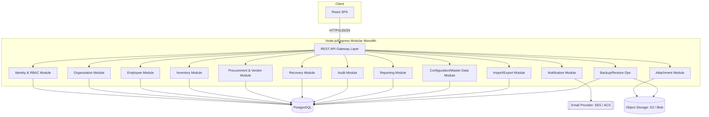

# Architecture & Technology Stack
## SPQR Inventory Management

**Version:** 1.0 | **Date:** 2026-07-09

## 1. Architecture Style: Modular Monolith

A single deployable backend service, internally organized into the 13 modules defined in *04-Module-Breakdown.md* (Organization, Identity/RBAC, Employee, Inventory, Procurement/Vendor, Recovery, Notifications, Audit, Reporting, Import/Export, Configuration, Attachments, Platform Ops).

**Why not microservices:** microservices would require a service mesh, inter-service auth, multiple databases or careful schema-per-service discipline, distributed tracing, and several times the deployment/monitoring cost — none of which this product needs at pilot/early scale. A modular monolith gives the same internal separation of concerns (each module has its own folder, own service layer, own data-access layer, and communicates with other modules through defined interfaces, never by reaching into another module's tables directly) without the operational cost. If a module later needs to scale independently (e.g., reporting under heavy load), it can be extracted because the boundary already exists in code.

## 2. Technology Stack

| Layer | Choice | Why |
|---|---|---|
| Frontend | React (Vite) + TypeScript, single SPA | One codebase for all roles (UI hides/shows by permission); Vite keeps build tooling light. |
| Backend | Node.js + Express, TypeScript | Same language as frontend — one hiring pool, shared types/validation, minimal context switching. |
| Database | PostgreSQL (single instance/managed) | One relational engine handles every module (transactional data, JSON columns for flexible master-data config, full-text search for basic reporting). No separate NoSQL/search/cache store in v1. |
| ORM | Prisma | Type-safe schema, built-in migrations, works identically against AWS RDS Postgres or Azure Database for PostgreSQL. |
| Auth | JWT (access + refresh token), bcrypt password hashing | Stateless auth scales horizontally without a session store; refresh token rotation covers the 30-minute-timeout / re-auth requirements (FR-6). |
| File storage | S3-compatible object storage (AWS S3 or Azure Blob Storage via a thin storage adapter) | Cheap, durable, and both clouds expose an S3-compatible or equivalent SDK behind one interface. |
| Email | AWS SES or Azure Communication Services (same adapter pattern) | Pay-per-email, no mail server to run. |
| Background jobs | node-cron in-process (backups trigger, escalation checks, low-stock scans) | Avoids running a separate queue/worker service for a pilot-scale product; revisit (e.g., add a real queue) only if job volume demands it. |
| Containerization | Docker (single image for backend, single image for frontend static build) | Identical artifact deployed to either cloud. |

This is intentionally the smallest stack that satisfies all 35 workflows. No message queue, no Redis, no search engine, no microservices, no Kubernetes in v1 — every one of those can be added later if usage data justifies it, per the cost principle in BRD Section 7.

## 3. Multi-Tenancy Model

**Shared database, shared schema, `organization_id` on every tenant-scoped table** ("pool" model). Chosen over database-per-tenant because:
- It is the cheapest option (one database instance, one set of connections, one backup job) and the simplest to operate.
- Postgres row-level security (RLS) policies enforce tenant isolation at the database layer, not just in application code, so a bug in one query can't leak another org's data.
- The Sparquer Super Administrator role bypasses RLS via a dedicated platform-level connection role, for legitimate cross-tenant administration (org onboarding, support).

If a future customer requires physical data isolation for compliance reasons, that org can be migrated to a dedicated schema or database without changing application code (Prisma's schema is tenant-agnostic).

## 4. High-Level Component Diagram

## 5. Cross-Cutting Concerns

- **RBAC enforcement:** every API route declares required module/action permissions; a single middleware checks the caller's role(s) against the requested permission before the controller runs. Enforced server-side always — the UI hiding a button is a convenience, never the security boundary.
- **Audit logging:** a single audit middleware wraps every mutating request, capturing user, org, IP, user agent, entity, old value, new value, and timestamp, per FR-27.
- **Validation:** shared TypeScript types + zod schemas between frontend and backend so a single source of truth defines "what a valid Employee looks like," reducing duplicate validation logic and bugs.
- **Notifications:** a single internal event bus (in-process, e.g., a typed EventEmitter) that modules publish domain events to (e.g., `employee.created`, `procurement.escalated`); the Notification module subscribes and fans out to email/bell/SMS — this keeps modules from calling each other directly for side effects.
- **Approval chains:** modeled as a generic, configurable `ApprovalWorkflow` engine (levels + role mapping + escalation timers, per FR-35's "Approval Workflows" master data) so the same engine drives procurement, indents, and any future approval-gated process, rather than hardcoding the Tech Manager → Senior Manager → Finance → MD chain in multiple places.

## 6. Environments

| Environment | Purpose | Notes |
|---|---|---|
| Local/dev | Developer machines | Docker Compose: Postgres + backend + frontend. |
| Staging | Pre-release validation | Smallest cloud tier, mirrors production topology. |
| Production | Live tenants | Sized per deployment guide; scales vertically first (cheaper), horizontally only if/when needed. |

## 7. Why This Meets "Enterprise Standards" Without Enterprise Cost

Enterprise-standard practices retained: layered architecture (controller → service → repository), RBAC down to the action level, full audit trail, environment separation, infrastructure as code, automated backups, and a documented deployment path for two clouds. What's deliberately *not* adopted at v1 scale: microservices, Kubernetes, multiple database technologies, and a dedicated message broker — these are enterprise scaling patterns for enterprise scaling problems, and adopting them before the product has that scale would directly violate the low-cost/simplicity requirement in BRD Section 7.

---
*Next: 03-Data-Model.md*
