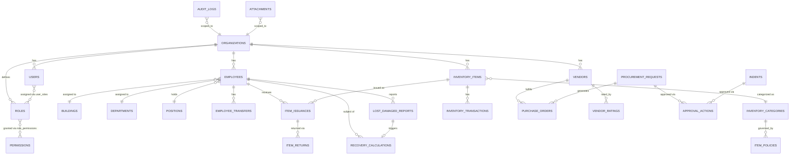

# Data Model
## SPQR Inventory Management

**Version:** 1.0 | **Date:** 2026-07-09

All tenant-scoped tables carry an `organization_id` foreign key and are protected by a Postgres row-level security policy (see 02-Architecture.md, Section 3). Every table also carries standard audit columns: `created_at`, `created_by`, `updated_at`, `updated_by`, `is_active`.

## 1. Entity List by Domain

### Platform / Organization
- **organizations** — id, name (unique), subscription_plan, status (pending/active/suspended), logo_url, contact_info (jsonb), business_hours (jsonb)
- **super_admins** — platform-level users, not tied to an organization

### Identity & Access
- **users** — id, organization_id, username (unique per org), email (unique per org), password_hash, must_change_password, failed_login_count, locked_until, last_login_at
- **roles** — id, organization_id (nullable = system-defined), name (unique per org), is_system_defined
- **permissions** — id, module, screen, action (create/view/update/delete/approve/export)
- **role_permissions** — role_id, permission_id
- **user_roles** — user_id, role_id
- **password_history** — user_id, password_hash, changed_at
- **sessions** — id, user_id, refresh_token_hash, expires_at, ip, user_agent

### Master Data / Configuration
- **buildings** — id, organization_id, name, code (unique per org), location, floors
- **departments** — id, organization_id, name, code
- **positions** — id, organization_id, name
- **employee_categories** — id, organization_id, name
- **inventory_categories** — id, organization_id, name (Uniforms, Shoes, PPE, Safety Equipment, Tools, Consumables, …)
- **item_policies** — id, organization_id, inventory_category_id, annual_allocation, replacement_frequency, recovery_policy (jsonb), useful_life_months, recoverable_value
- **notification_settings** — id, organization_id, channel, reminder_frequency, escalation_rules (jsonb)
- **approval_workflows** — id, organization_id, process_type (procurement/indent/…), levels (jsonb: ordered role list), escalation_hours, delegation_rules (jsonb)
- **stock_thresholds** — id, organization_id, inventory_item_id (nullable = category default), low_stock_qty (default 20), critical_stock_qty (default 5)

### Employees
- **employees** — id, organization_id, user_id (nullable — not every employee logs in), employee_code (unique per org), name, joining_date, leaving_date, building_id, department_id, position_id, employee_category_id, status (active/transferred/leaving/exited/rehired)
- **employee_transfers** — id, employee_id, from_building_id, to_building_id, from_department_id, to_department_id, approved_by, approved_at
- **employee_history** — id, employee_id, event_type, details (jsonb), event_at

### Inventory
- **inventory_items** — id, organization_id, item_code (unique per org), name, inventory_category_id, unit_cost, current_stock_qty
- **inventory_transactions** — id, organization_id, inventory_item_id, transaction_type (purchase/receipt/issue/return/replacement/loss/damage/adjustment), quantity, employee_id (nullable), reference_id (PO/indent/etc.), condition (good/damaged), notes
- **item_issuances** — id, employee_id, inventory_item_id, quantity, issued_at, issued_by (store keeper), signature_ref, policy_id
- **item_returns** — id, item_issuance_id, quantity, returned_at, condition, inspected_by, disposition (restock/scrap/repair)
- **lost_damaged_reports** — id, employee_id, inventory_item_id, type (lost/damaged), reported_at, manager_verified_by, recovery_amount, finance_approved_by, replacement_issued (bool)

### Vendor & Procurement
- **vendors** — id, organization_id, name, documents (jsonb refs to attachments), status (pending/verified/approved), performance_score
- **vendor_ratings** — id, vendor_id, purchase_id, delivery_rating, quality_rating, price_rating, rated_at
- **procurement_requests** — id, organization_id, source_type (low_stock/critical_stock/indent), inventory_item_id, quantity, status, current_approval_level, cancelled_reason
- **indents** — id, organization_id, department_id, raised_by, items (jsonb or child table), status, current_approval_level
- **purchase_orders** — id, procurement_request_id, vendor_id, status, total_amount, po_number
- **approval_actions** — id, entity_type (procurement/indent), entity_id, level, approver_user_id, decision (approved/rejected/escalated), acted_at, sla_due_at

### Recovery & Finance Hand-off
- **recovery_calculations** — id, employee_id, source_type (exit/loss/damage), item_issuance_id, join_date, leave_or_incident_date, policy_id, calculated_amount, finance_verified_by, finance_verified_at, salary_deduction_ref

### Notifications & Audit
- **notifications** — id, organization_id, user_id, channel (email/bell/sms/push), event_type, payload (jsonb), read_at, sent_at
- **audit_logs** — id, organization_id, user_id, entity_type, entity_id, action, old_value (jsonb), new_value (jsonb), ip_address, user_agent, occurred_at

### Attachments
- **attachments** — id, organization_id, entity_type, entity_id, file_url, file_name, mime_type, virus_scan_status, uploaded_by, uploaded_at

### Platform Ops
- **backup_jobs** — id, started_at, completed_at, storage_ref, encrypted (bool), retention_expires_at, verified (bool)
- **import_jobs** — id, organization_id, module, file_ref, status, total_rows, success_rows, error_rows, error_report_ref
- **export_jobs** — id, organization_id, module, format (xlsx/csv/pdf), filters (jsonb), file_ref, requested_by

## 2. Core Relationships (ERD)

## 3. Key Data Rules (from BRD business rules)

- `organizations.name` unique platform-wide; `users.username`/`email` unique per organization; `roles.name` unique per organization; `buildings.code`, `inventory_items.item_code`, `employees.employee_code` unique per organization.
- System-defined roles (`roles.is_system_defined = true`) cannot be deleted.
- Master data referenced by any transaction cannot be hard-deleted — only soft-deleted (`is_active = false`), and inactive records are excluded from new transactions.
- `item_issuances` cannot exceed `item_policies.annual_allocation` for the relevant employee/period — enforced in the service layer at issue time.
- `recovery_calculations` requires `finance_verified_by` populated before an `employees.status` transition to `exited` is allowed.

---
*Next: 04-Module-Breakdown.md*
